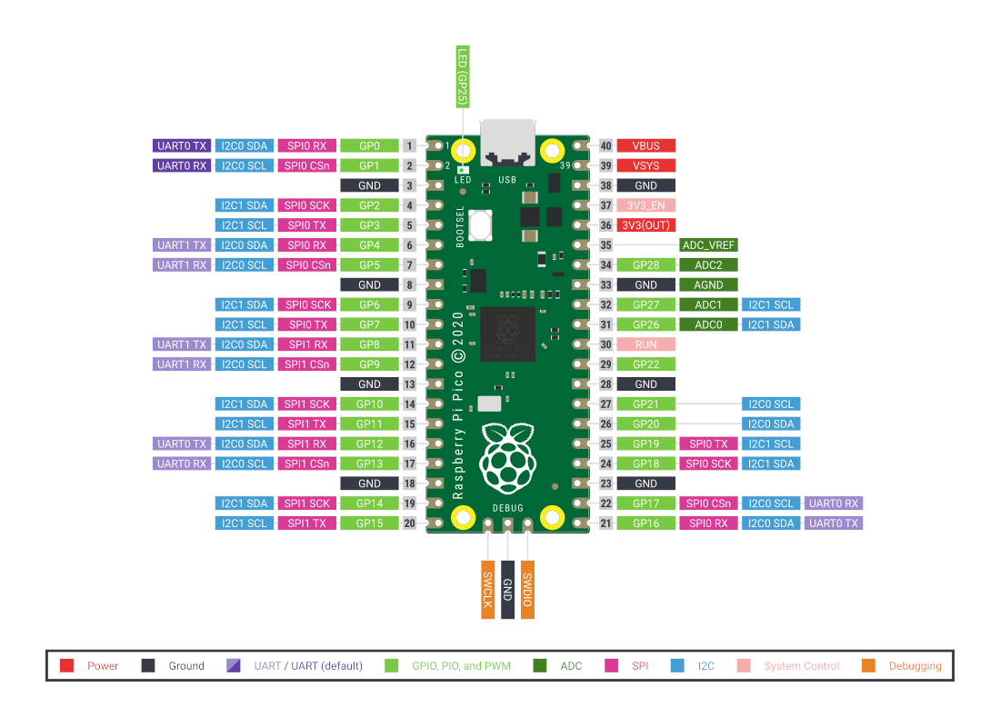

# HomeMonitor
给自己的圣诞礼物
A Xmas gift for myself.
Due to the lockdown this year, dont have really much choices to have my vacation, so I just got these rasperri pi stuff. 
So, this project is mainly aimming on using rasperry pi to develop a smart home system which can understand the voice command and 
do some work for the users. 
Its not really fancy as it sounds like right now, but lets see where it goes. 
Currently, I have implemented several useful functionalities like voice recognition which can translate the voice into text.
Then the baby jarvis will match the keywords like "weather" " time" stuff like that, and fetch the related inforamtion online,
and report to the users by voice. 

due to 今年lockdown 了， 所以很sad 不能出去玩。
准备树莓派搞一搞， 弄个家庭各种数据的监控

菜鸡没玩过 看别人做的很好玩， 所以准备自己写一个。
玩玩看吧
总之很期待

后续有可能写一个智能识别的小车 用来放牧我的🐱

  Pins Layout for Raspberry Pi Pico

    

## 功能 ：
- 温度 & 湿度 ： 
    - 使用原件：DHT11
- 气体检测
    - 使用原件 ：MQ5
- 声音监测：
    - 使用原件 ：LM386
